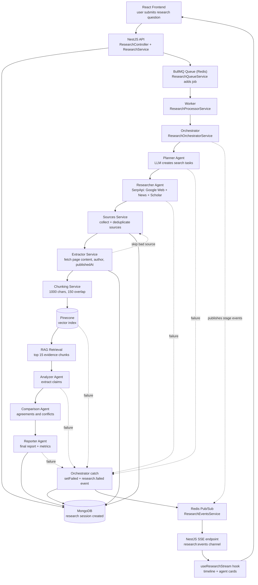
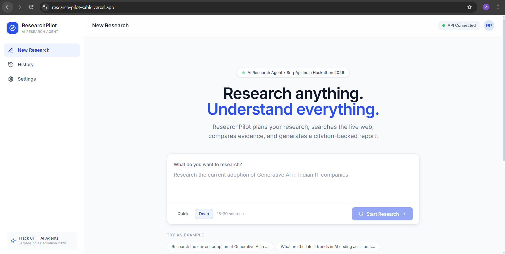
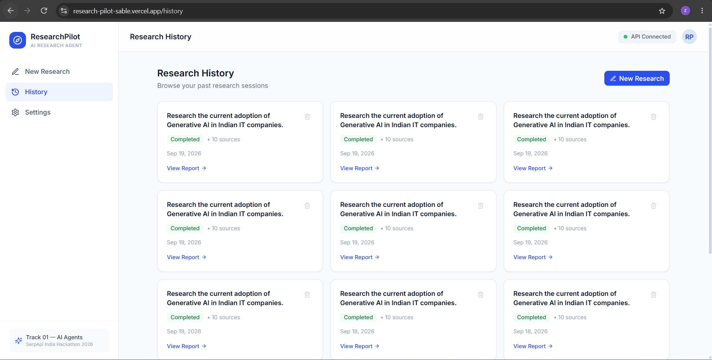
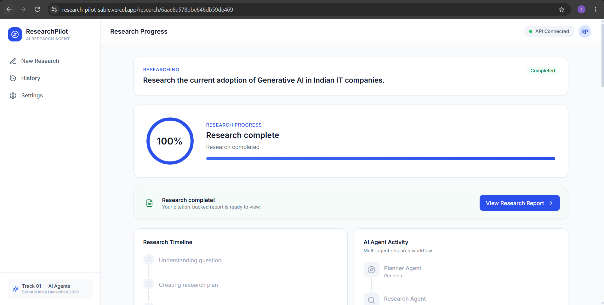
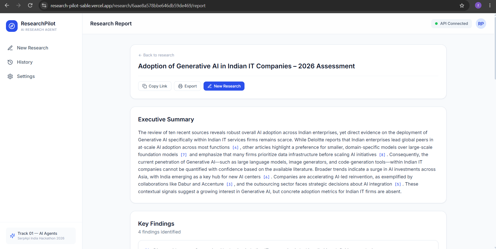
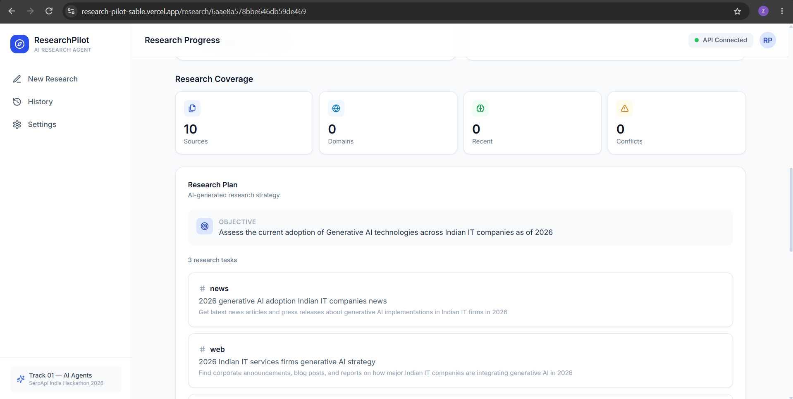

#  AI Research Agent

## Problem It Solves

Researching a topic online is slow and manual. You search many queries, open dozens of pages, read long articles, compare what different sources say, and then write up the findings with citations. Search results also only show short snippets, and different sources often contradict each other without it being obvious.

**AI Research Agent automates this whole process.** Ask one question and the system:

- Plans several focused searches instead of relying on a single query
- Collects live sources from Google Web, Google News and Google Scholar and removes duplicates
- Reads the full page content, not just snippets
- Finds the most relevant evidence using semantic search (RAG)
- Extracts claims and checks where sources agree or conflict
- Produces a cited report while showing live progress

## Live Deployment

Try it live: https://research-pilot-sable.vercel.app/

## Demo Video

Watch the demo (under 3 minutes): https://drive.google.com/file/d/1F8YGCjxk0DdKZ5GxoRyRet0F32uTAe-g/view

## Who It Helps

- **Students and academics** who need a quick, cited overview of a topic, including scholarly papers
- **Journalists and analysts** who need to compare what different sources claim
- **Founders and product teams** doing market and competitor research
- **Anyone** who wants a sourced answer instead of a pile of search tabs

## Tech Stack

| Layer | Technology |
|-------|------------|
| Frontend | React, TypeScript, Vite, Tailwind CSS, React Router |
| Backend | NestJS, TypeScript |
| Database | MongoDB (Mongoose) |
| Queue / Cache | Redis, BullMQ |
| Real-time | Server-Sent Events (SSE), Redis Pub/Sub |
| Search API | SerpApi (Google Web, Google News and Google Scholar) |
| LLM | Llama |
| Vector Database | Pinecone |
| Scraping | Axios + custom HTML text extraction |

## How It Uses SerpApi

SerpApi is the discovery layer of the agent. The Researcher Agent calls it for every search task the Planner creates, using three engines:

- **Google Web** (`engine=google`) for general web sources
- **Google News** (`engine=google_news`) for recent and time-sensitive coverage
- **Google Scholar** (`engine=google_scholar`) for academic papers, citations and research publications

Results from all three engines are merged and deduplicated by URL in the Sources Service before the full pages are fetched, chunked and embedded. Running several focused queries across web, news and scholarly sources gives broader, fresher and more credible coverage than a single search.


## Architecture



## Setup

### Prerequisites
- Node.js 20+
- MongoDB (local or Atlas)
- Redis
- API keys: SerpApi, Pinecone, and your Llama provider

### 1. Clone
```bash
git clone https://github.com/beingzuhairkhan/ResearchPilot.git
cd ResearchPilot
```

### 2. Backend
```bash
cd backend
npm install
cp .env.example .env
```
Fill in `.env`:
```env
MONGODB_URI=
REDIS_URL=
SERPAPI_API_KEY=
PINECONE_API_KEY=
PINECONE_INDEX=
LLM_API_KEY=
LLM_BASE_URL=
LLM_MODEL=
```
```bash
npm run start:dev
```

### 3. Frontend
```bash
cd frontend
npm install
cp .env.example .env   # set VITE_API_URL, e.g. http://localhost:3000
npm run dev
```

Open http://localhost:5173 and submit a research question.

## Disclosures

- **Project status:** New project. It was built from scratch during this hackathon and did not exist before.
- **AI tools used:** Claude for code assistance and development support.

## Screenshots

### Home


### Research History


### Report Developing


### Final Report


### Research Coverage
